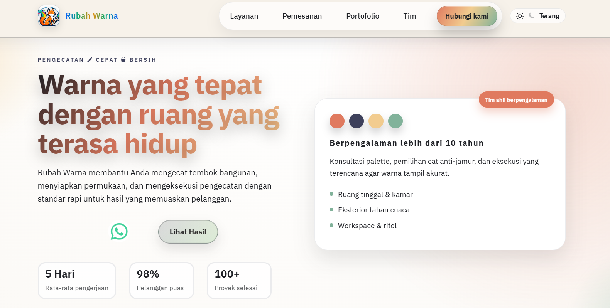

# 🌈 Rubah Warna - Website Pengecatan Modern & Profesional

[](https://app.netlify.com/)
[](https://github.com/)
[](https://developer.mozilla.org/)

## 🎨 Tentang Rubah Warna

**Rubah Warna** adalah layanan pengecatan rumah, kantor, dan properti komersial dengan hasil **rapi, cepat, tahan lama**. Website ini dibuat dengan desain modern, **responsive** (mobile-first), **dark/light theme**, animasi smooth, dan performa tinggi (no framework berat).

### ✨ Fitur Utama

- ✅ **Modular Structure**: HTML partials (hero, services, portfolio, dll.) dimuat via JS.
- ✅ **Theme Toggle**: Ganti light/dark mode dengan 1 klik.
- ✅ **Animations**: Scroll-triggered reveals + orbit background.
- ✅ **Responsive Design**: CSS Grid/Flexbox + mobile breakpoints.
- ✅ **Performance**: Vanilla JS ES modules, no bloat.
- ✅ **Components**: Navbar sticky, WhatsApp fallback, section observers.


_(Screenshot hero section dengan efek orbit dinamis)_

## 🛠 Tech Stack

```
HTML5 | CSS3 (Modular Imports) | Vanilla JavaScript (ES Modules)
├── Google Fonts (IBM Plex Sans)
├── Font Awesome & Bootstrap Icons
├── Partials System (load-includes.js)
└── Observers (IntersectionObserver API)
```

Struktur folder:

```
rubah-warna/
├── index.html          # Main entry
├── assets/
│   ├── css/           # Modular CSS (base, components, responsive)
│   ├── js/            # ES modules (main.js, components/, observers/)
│   └── images/
├── partials/          # HTML snippets (hero.html, navbar.html, dll.)
└── README.md          # Ini kamu!
```

## 🚀 Cara Menjalankan (Local Development)

1. **Clone/Download** repo ini.
2. **Buka di Browser**:
   ```bash
   # Windows (dari folder proyek)
   start index.html
   ```
   Atau drag `index.html` ke browser.
3. **Live Server** (opsional, install via npm):
   ```bash
   npx live-server
   ```

Website langsung jalan **tanpa install apa-apa**! Test di mobile juga langsung responsive.

## 📱 Demo Fitur

- **Scroll ke sections**: Lihat animations reveal.
- **Klik sun/moon icon**: Toggle theme.
- **Hover cards**: Efek interactive di portfolio/services.

## 🤝 Kontribusi

1. Fork repo.
2. Buat branch `feature/nama-fitur`.
3. Commit & PR.
4. Ideas: Tambah quote, PWA support, atau integrasi GSAP.

## 📄 Lisensi

[MIT License](LICENSE) - Free to use & modify!

## 👨‍💼 Kontak

- WhatsApp: [Klik untuk chat](https://wa.me/628xxxxxx)
- Email: info@rubahwarna.com

**Dibuat dengan ❤️ untuk bisnis lokal Indonesia. Mari rubah warna rumahmu!** 🏠✨

---

_Terakhir update: Maret 2026_
